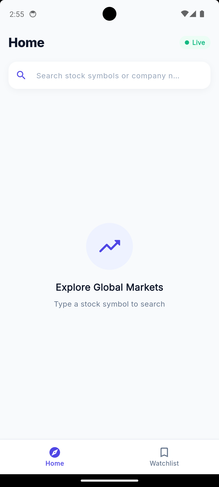
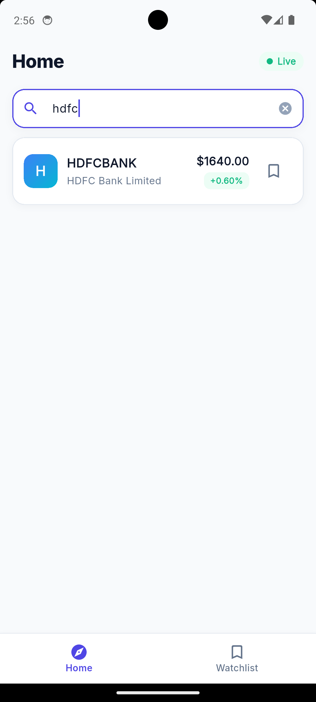
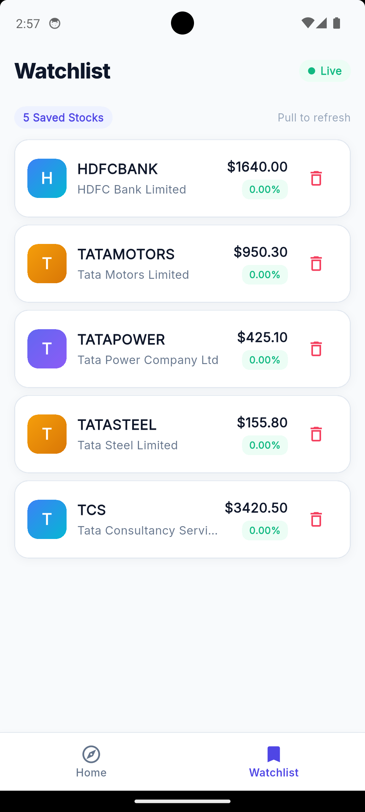
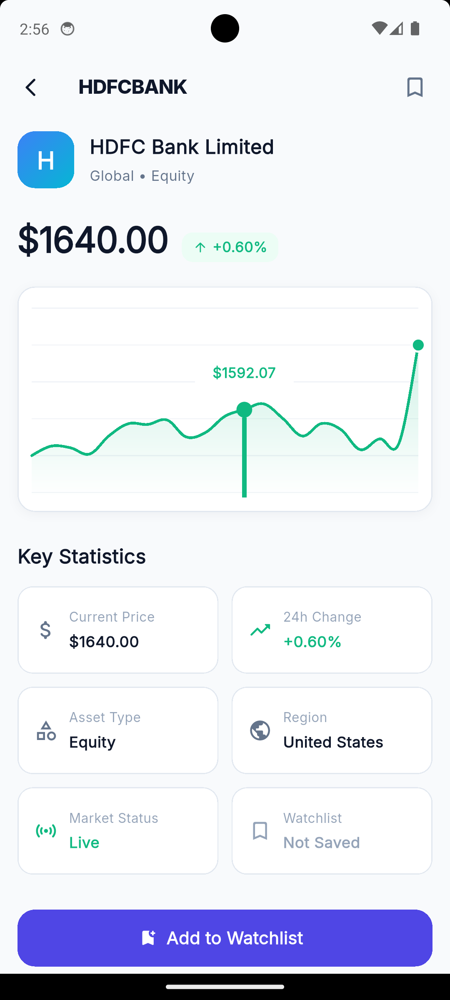
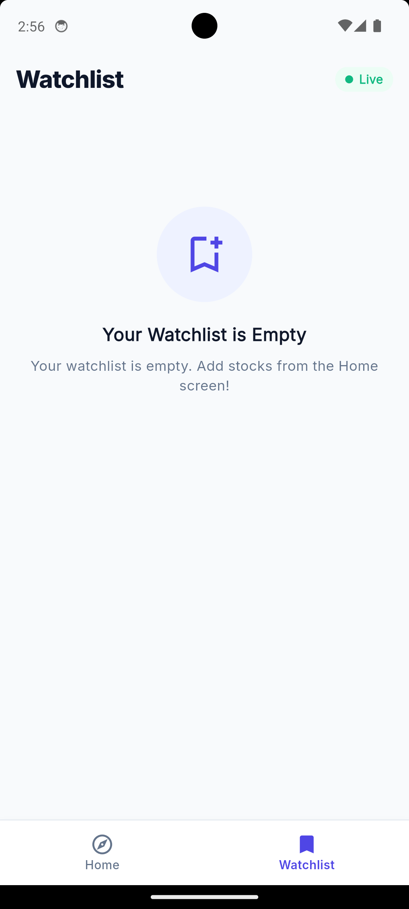

# 📈 Stockly

A modern stock tracking application built with **Flutter**, **Clean Architecture**, **BLoC/Cubit**, **Hive Local Database** and **Alpha Vantage API**.

---

## 📱 App Showcase

| Home Screen | Search View | Watchlist | Stock Detail | Empty Watchlist |
| :---: | :---: | :---: | :---: | :---: |
|  |  |  |  |  |

---

## ✨ Features

- **🔍 Real-Time Stock Search**: Search global equities with fast debounced query input.
- **📌 Local Watchlist Management**: Save and persist your favorite stocks locally using Hive.
- **📊 Interactive Price Charts**: Visual trend sparklines powered by `fl_chart` with gradient area fills.
- **👆 Swipe-to-Dismiss**: Easily remove watchlist items with smooth swipe gestures.
- **🛡️ Rate-Limit Resilience & Fallback**: Intelligent fallback mechanisms when API rate limits (25 calls/day) are reached.
- **🎨 Modern Design Tokens**: Customized Google Fonts (*Inter*), symbol avatar gradients and price badges.

---

## 🏗️ Architecture Pattern

Stockly follows **Clean Architecture** principles to enforce strict separation of concerns, scalability and testability.

```text
lib/
├── core/                       # Shared utilities, theme, network & database
│   ├── constants/              # Colors, AppStrings, API constants
│   ├── database/               # Hive database service
│   ├── network/                # ApiClient & Dio configuration
│   ├── routes/                 # Navigation & bottom tabs
│   └── theme/                  # Google Fonts Inter design system
│
└── features/
    ├── home/                   # Search & Stock Details Feature
    │   ├── data/               # Models & Remote Data Sources
    │   ├── domain/             # Entities, Repositories & Use Cases
    │   └── presentation/       # BLoC, Cubit & Refactored UI Widgets
    │
    └── watchlist/              # Watchlist Feature
        ├── data/               # Local Hive DataSource & Repositories
        ├── domain/             # Watchlist Entities
        └── presentation/       # WatchlistBloc & UI Cards/States
```

---


## 🛠️ Tech Stack & Libraries

| Category | Package / Tool |
| :--- | :--- |
| **Framework** | Flutter (Material 3) |
| **State Management** | `flutter_bloc` & `Cubit` |
| **Networking** | `dio` & `ApiClient` |
| **Local Database** | `hive` & `hive_flutter` |
| **Charts** | `fl_chart` |
| **Typography** | `google_fonts` (Inter) |
| **UI Loading** | `skeletonizer` |

---

## 🚀 Getting Started

### 1. Prerequisites
- Flutter SDK (`^3.12.2` or higher)
- Free Alpha Vantage API key from [alphavantage.co](https://www.alphavantage.co/support/#api-key)

### 2. Environment Setup
Create a `.env` file in the project root:
```env
ALPHA_VANTAGE_API_KEY=your_api_key_here
```

### 3. Run the Project
```bash
# Fetch dependencies
flutter pub get

# Run on connected device/emulator
flutter run
```
